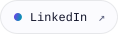
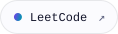

<picture><source media="(prefers-color-scheme: dark)" srcset="./metrics/hero-dark.svg"></picture>

<a href="https://www.linkedin.com/in/priyanshu-jimiwal-a862713a9"><picture><source media="(prefers-color-scheme: dark)" srcset="./metrics/link-linkedin-dark.svg"></picture></a>&nbsp;
<a href="https://leetcode.com/u/priyanshu_jimiwal/"><picture><source media="(prefers-color-scheme: dark)" srcset="./metrics/link-leetcode-dark.svg"></picture></a>&nbsp;
<a href="mailto:priyanshujimiwal02@gmail.com"><picture><source media="(prefers-color-scheme: dark)" srcset="./metrics/link-email-dark.svg"></picture></a>

 

<picture><source media="(prefers-color-scheme: dark)" srcset="./metrics/activity-dark.svg"></picture>

<picture><source media="(prefers-color-scheme: dark)" srcset="./metrics/toolkit-dark.svg"></picture>

<a href="https://github.com/priyanshujimiwal/seasonal-demand-forecasting"><picture><source media="(prefers-color-scheme: dark)" srcset="./metrics/projects-dark.svg"></picture></a>

<picture><source media="(prefers-color-scheme: dark)" srcset="./metrics/dsa-dark.svg"></picture>

cards are generated by <a href="./src">./src</a> and refreshed by GitHub Actions every 6 hours

